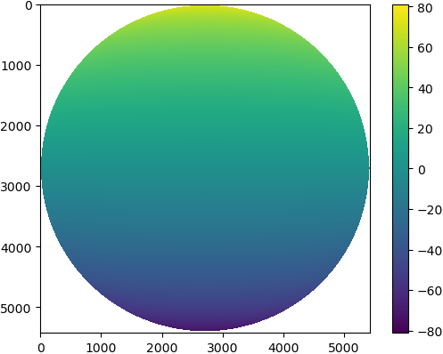
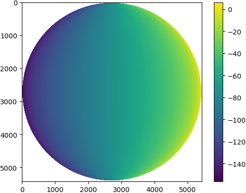

# goes-latlon
Python script that can be used to generate latitude/longitude coordinates for GOES-16 full-disk extent. 🌎🛰️

The grid files can be accessed in this repository from the `data` directory.

## Install
Clone the repository:
```
git clone https://github.com/uba/goes-latlon.git
```
Go to the source code folder:
```
cd goes-latlon
```
Install:
```
pip3 install -r requirements.txt
```

## Usage
```
python generate-all.py
```
The script will generate latitude/longitude values for GOES-16 full-disk extent and save result to the `data` directory.

The result is a set of netCDF files for each spatial resolution (1.0, 2.0, 4.0 and 10 kilometers).

Basically, each file contains grids for latitude and longitude that is the same size as the data array in the GOES netCDF file (e.g. `CMI` array). netCDF file is encoded using `int16` datatype, `scale_factor` and `add_offset` attributes.

* `data/goes16-full-disk-lat-lon-1.0km.nc`
* `data/goes16-full-disk-lat-lon-2.0km.nc`
* `data/goes16-full-disk-lat-lon-4.0km.nc`
* `data/goes16-full-disk-lat-lon-10.0km.nc`

## Read Example
````python
from netCDF4 import Dataset

# Define path to [lat,lon] grid file
path = './data/goes16-full-disk-lat-lon-2.0km.nc'

# Open using netCDF4 package
nc = Dataset(path)

# Get values
lat_values = nc.variables['lat'][:]
lon_values = nc.variables['lon'][:]

nc.close()
````

## Data Preview
Latitudes - 2km (5424 x 5424)| Longitudes - 2km (5424 x 5424)
--- | ---
 | 

*Note: Currently GOES-16 satellite is positioned at longitude -75.0, latitude 0.0.*

## References
GOES-R SERIES PRODUCT DEFINITION AND USERS’ GUIDE (PUG) | https://www.goes-r.gov/products/docs/PUG-L2+-vol5.pdf - Session 4.2.8.1: Navigating from N/S Elevation Angle (y) and E/W Scanning Angle (x) to Geodetic Latitude (φ) and Longitude (λ)

Joshua Hrisko - GOES-R Satellite Latitude and Longitude Grid Projection Algorithm. https://makersportal.com/blog/2018/11/25/goes-r-satellite-latitude-and-longitude-grid-projection-algorithm

Geostationary Satellite View - https://proj.org/operations/projections/geos.html
